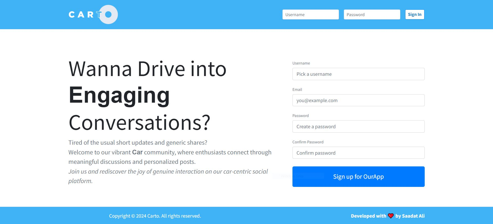

# Carto v2.0

## Overview

Carto is a Laravel-based social media application that provides all the basic functionalities for users to interact with each other. With Carto, users can sign up, log in, create, edit, and delete posts, follow/unfollow other users, and explore profiles with post histories, follower lists, and following lists.

## Video Preview
Check out the Detailed version of the project:  

- VERISON 1.0 [Youtube Link](https://bit.ly/4bxezn6)  
- VERISON 2.0 [Youtube Link](https://bit.ly/4bhafaR)  

## Features

- User authentication: Sign up, log in, and log out securely.
- Post management: Create, edit, and delete posts.
- User interaction: Follow and unfollow other users.
- Profile pages: View profiles with user posts, follower lists, and following lists.
- Authorization: Basic authorization functionalities such as middleware, policies, and type hinting.
  # V2.0 FEATURES
  - Search Functionality
  - Chat Feature for all user
  - Email integration for post notification
  - Api calls for login, create & delete post

## Technologies Used

- Laravel: A powerful PHP framework for building web applications.
- MySQL: Relational database management system used for data storage.
- Blade: Laravel's templating engine for generating HTML.
- JavaScript: Used for client-side interactivity.
- CSS: Styling the user interface.

## Installation

To run Carto locally, follow these steps:

1. Clone the repository: `git clone https://github.com/your-username/carto.git`
2. Install dependencies: `composer install`
3. Create a `.env` file by copying `.env.example` and updating the necessary configurations (database settings, etc.).
4. Generate an application key: `php artisan key:generate`
5. Run `php artisan storage:link`
6. Migrate the database: `php artisan migrate`
7. Serve the application: `php artisan serve`
8. Run the emial job:  `php artisan queue:work`

## Usage

1. Navigate to the application URL in your web browser.
2. Sign up for a new account or log in with existing credentials.
3. Explore the various features such as creating/editing/deleting posts, following/unfollowing users, and viewing user profiles.

## Contributing

Contributions are welcome! If you'd like to contribute to Carto, please follow these steps:

1. Fork the repository.
2. Create a new branch for your feature or bug fix: `git checkout -b feature-name`
3. Make your changes and commit them: `git commit -m "Add new feature"`
4. Push to your branch: `git push origin feature-name`
5. Submit a pull request detailing your changes.

## License

This project is licensed under the [MIT License](LICENSE).

## Contact

For any inquiries or support, please contact sadiraja500@gmail.com.

